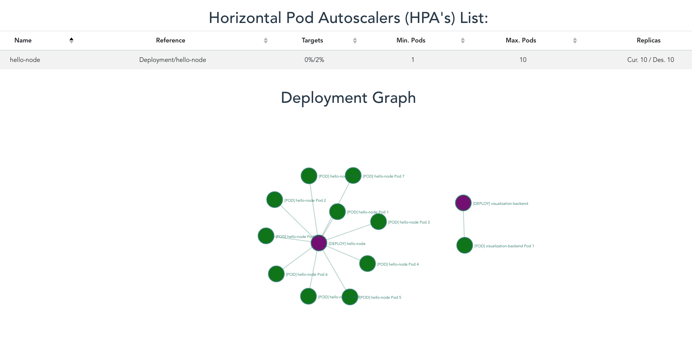

# [APPS40](https://github.com/microsoft/ignite-learning-paths-training-apps/tree/master/apps40) Scaling demo frontend

> Improvement for Scott Coulton's learning path on [APPS40](https://github.com/microsoft/ignite-learning-paths-training-apps/tree/master/apps40) creating a GUI for the scaling demo



## Deploying

This repository contains a Helm index. This means you can add it to your local helm repos without having to clone it:

```sh
$ helm repo add apps40 https://lsantos.dev/apps40-scalingdemo-frontend/helm
```

Then install it on your cluster using:

```sh
$ helm upgrade --install --atomic visualization-frontend-default --set env=default --set image.tag=v0.1.1 --set 'ingress.hostname="cluster-info.your-cluster-domain.com"' --set environment.API_URL="http://visualization-api.your-cluster-domains.com" --namespace your-namespace apps40/visualization-frontend
```

## Caveats

- This is a generic cluster info website, it can be used with any cluster
- It uses the internal Kubernetes API to fetch both HPA and Deployment information
